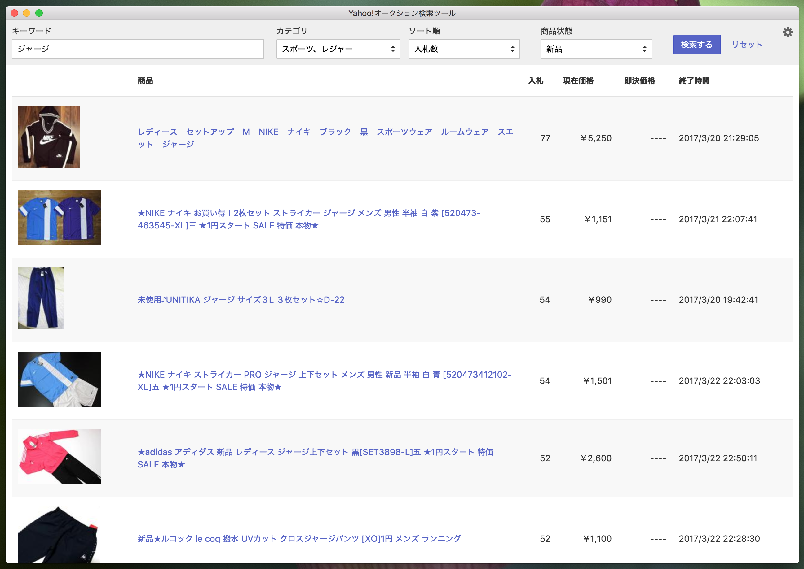

# 概要

Yahooオークションに出品されている商品を検索できるデスクトップツールです

+ 商品検索には、[オークションWeb API](http://developer.yahoo.co.jp/webapi/auctions/)を使用しています
    - 利用には[アプリケーションID](https://www.yahoo-help.jp/app/answers/detail/p/537/a_id/43397)の取得が必要です
+ GUIには、[Electron](https://electron.atom.io/)を使用し、HTML/CSS/JavaScriptで実装しています

# 開発

`$ git clone git@gitlab.com:yono/Yahoo-Auction-Search-Tool.git`  
`$ cd Yahoo-Auction-Search-Tool`  
`$ npm install`

`$ npm run debug`

# リリース

`$ npm run build-for-darwin` (MacOS向け)
